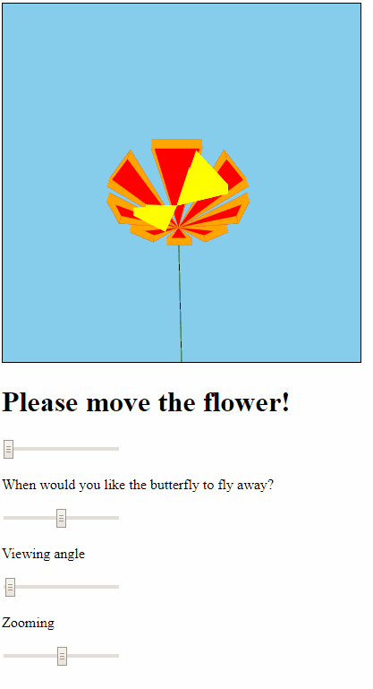
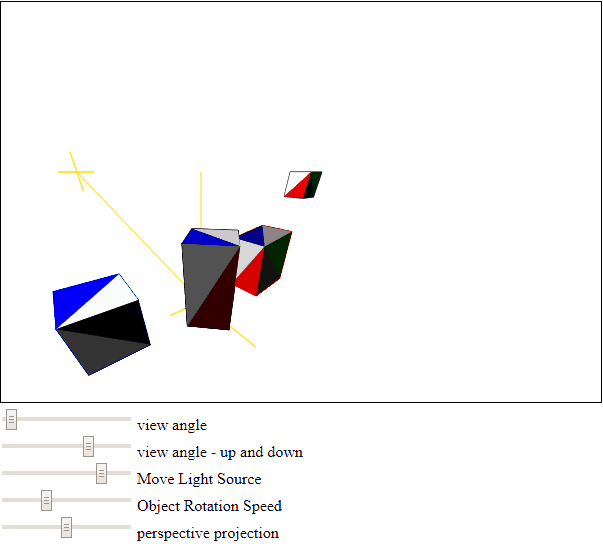

## Computer Graphics Projects

**Project3. 3D Flower** 

Using twgl library to create animated 3D objects & Graphics Pipeline experiments with viewing angle and zooming 
 
 
 
*issue : Visibility. Because butterfly will always be drawn at the very last, it's on the top of everything else. How can we make butterfly to stay on top of the flower even if we change the view angle?* 
 

**Project4. Graphics Pipeline & Painter's Algorithm** 

Use Painter's Algorithm to solve visibility - determine which objects(solid) will be in front.  
 
*Painter's Algorithm? Every time we change the view point, sort items accordingly before drawing them in the scene.* 
 
 
 

